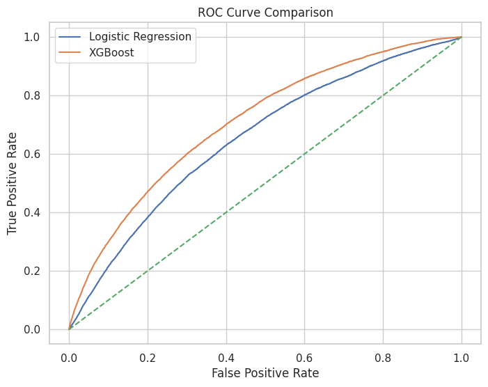
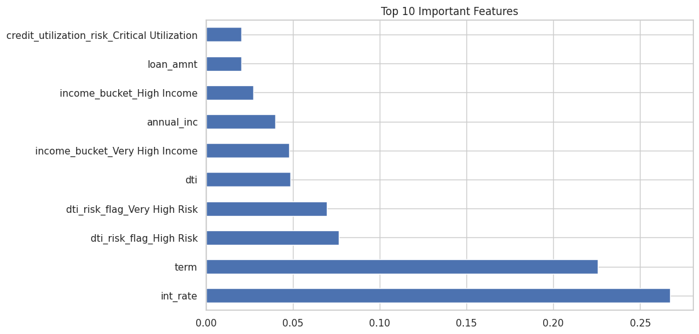
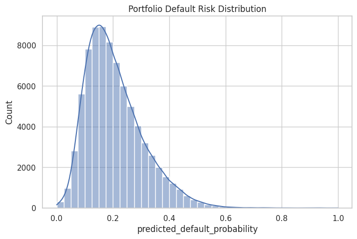

# Credit Risk Analytics: Loan Default Prediction & Risk Monitoring

## Project Overview

This project presents an **end-to-end credit risk analytics workflow** designed to evaluate borrower risk and predict loan default using machine learning techniques.

The objective is to simulate a **real-world credit risk assessment process used in fintech and banking institutions**, combining data analytics, risk modeling, and financial loss estimation.

The project covers:

- Data cleaning and preprocessing  
- Exploratory data analysis (EDA)  
- Feature engineering for credit risk  
- Machine learning model for default prediction  
- Risk segmentation of borrowers  
- Expected Loss calculation (PD × LGD × EAD)  
- Interactive risk monitoring dashboard (Power BI)

This project demonstrates the practical application of **data analytics and machine learning in financial risk management**.

---

# Business Problem

Financial institutions face significant losses due to loan defaults.

To minimize financial risk, lenders must:

- Identify high-risk borrowers  
- Estimate probability of default  
- Monitor portfolio risk exposure  
- Forecast potential financial losses  

This project simulates a **credit risk monitoring framework used by lending platforms**.

---

# Dataset

The dataset contains borrower and loan characteristics such as:

- Loan amount  
- Interest rate  
- Borrower income  
- Debt-to-income ratio (DTI)  
- Credit utilization  
- Loan purpose  
- Employment history  

These features are commonly used in **credit risk modeling**.

---

# Project Workflow

Raw Loan Data
↓
Data Cleaning
↓
Exploratory Data Analysis
↓
Feature Engineering
↓
Machine Learning Model
↓
Risk Score Generation
↓
Expected Loss Estimation
↓
Risk Monitoring Dashboard

---

# Feature Engineering

Several risk indicators were created:

- **DTI Risk Flag** – borrower leverage indicator  
- **Income Bucket** – borrower income segmentation  
- **Credit Utilization Risk** – credit card usage risk  
- **Employment Score** – employment stability proxy  
- **Loan Size Category** – segmentation of loan exposure  

These engineered features help improve **risk modeling accuracy**.

---

# Machine Learning Model

A classification model was developed to predict **loan default probability**.

Output variables include:

- Predicted default probability  
- Borrower risk score  
- Risk segmentation  

This allows lenders to **identify high-risk borrowers before loan approval**.

---

# Credit Risk Metrics

Key credit risk metrics were calculated:

## Probability of Default (PD)

Probability that a borrower will default.

## Loss Given Default (LGD)

Percentage of loan lost when default occurs.

## Exposure at Default (EAD)

Outstanding loan balance at the time of default.

## Expected Loss

Expected Loss represents the **anticipated financial loss from credit exposure**.

Expected Loss formula:
Expected Loss = PD × LGD × EAD

This metric is widely used in **banking risk management and regulatory frameworks**.

---

# Key Insights

Key findings from the analysis include:

- Borrowers with **high debt-to-income ratios** show significantly higher default rates.  
- **Credit utilization** is strongly associated with borrower risk.  
- **Income segmentation** helps differentiate repayment capacity.  
- Machine learning models can effectively estimate **default probability**.  
- Risk segmentation allows lenders to **prioritize high-risk borrowers for monitoring**.

---

# Key Model Visualizations

Below are several key visualizations generated from the machine learning model and risk analysis.

These figures provide insights into **model performance, important predictive features, and borrower risk segmentation**.

---

## ROC Curve – Model Performance

The ROC Curve evaluates the classification model’s ability to distinguish between **default and non-default borrowers**.

A higher Area Under the Curve (AUC) indicates stronger predictive performance.

This visualization demonstrates that the model is capable of effectively identifying **high-risk borrowers who are more likely to default**.

---

## Feature Importance – Key Risk Drivers

Feature importance analysis highlights which variables contribute most to predicting loan default.

Important predictors may include factors such as:

- Debt-to-Income Ratio (DTI)
- Credit Utilization
- Loan Amount
- Interest Rate
- Borrower Income

Understanding these drivers helps financial institutions identify **key risk factors influencing borrower default behavior**.

---

## Risk Score Distribution – Borrower Risk Segmentation

This visualization illustrates the distribution of **risk scores assigned to borrowers**.

Risk scores are used to segment borrowers into different risk categories, enabling lenders to:

- identify high-risk borrowers
- monitor portfolio risk exposure
- support data-driven credit decisions

Borrower risk segmentation is a common practice in **credit risk management and lending platforms**.

---

# Power BI Dashboard (Coming Soon)

An interactive **Credit Risk Monitoring Dashboard** will be developed using Power BI.

The dashboard will include:

- Portfolio risk overview  
- Borrower risk segmentation  
- Model prediction insights  
- Expected loss analysis  

This dashboard simulates a **risk analytics tool used by fintech and banking institutions**.

---

# Tools & Technologies

- Python  
- Pandas  
- NumPy  
- Scikit-learn  
- Matplotlib  
- Seaborn  
- Power BI  

---

# Repository Structure

credit-risk-analytics
│
├── data
│ └── loan_dataset_clean.csv
│
├── notebooks
│ └── credit_risk_analysis.ipynb
│
├── dashboard
│ └── powerbi_dashboard.pbix (coming soon)
│
├── images
│
├── requirements.txt
│
└── README.md

---

# Author

**Data Analytics Portfolio Project - Salsabila Eka Hariadi**

Focus areas:

- Credit risk analytics  
- Machine learning for finance  
- Financial data analysis  
- Business intelligence dashboards
