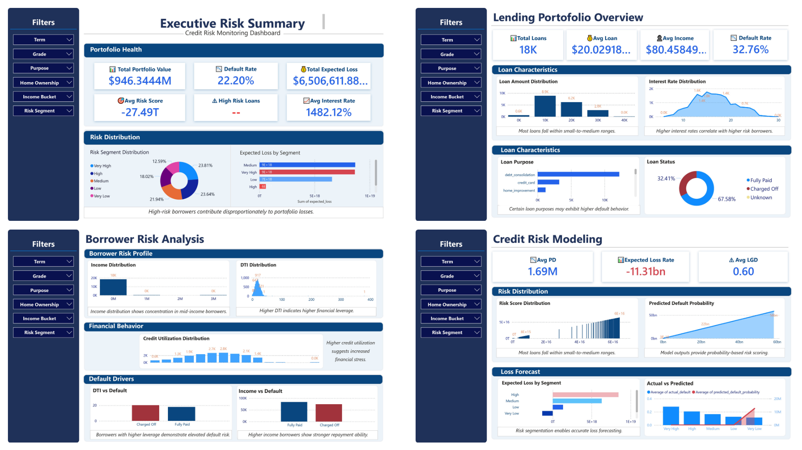

# Credit Risk Analytics: Loan Default Prediction & Risk Monitoring

## Executive Summary

This project delivers an **end-to-end credit risk analytics solution** designed to simulate how financial institutions assess borrower risk, predict loan defaults, and monitor portfolio exposure.

By integrating **data analytics, machine learning, and financial risk modeling**, this project demonstrates how data-driven insights can support **risk mitigation, credit decision-making, and financial loss forecasting**.

The solution includes:
- Predictive modeling of loan default probability  
- Borrower risk segmentation  
- Expected Loss estimation (PD × LGD × EAD)  
- Interactive risk monitoring dashboard (Power BI)  

This project reflects a **real-world implementation of credit risk analytics used in fintech and banking environments**.

---

## Business Problem

Loan defaults represent a major source of financial loss for lending institutions.

To effectively manage risk, financial institutions must:

- Identify high-risk borrowers before loan approval  
- Estimate the probability of default (PD)  
- Monitor portfolio-level risk exposure  
- Quantify potential financial losses  

This project simulates a **credit risk monitoring framework** that enables proactive and data-driven risk management.

---

## Dataset

The dataset contains borrower-level financial and behavioral attributes commonly used in credit risk modeling, including:

- Loan characteristics (amount, term, interest rate)  
- Borrower financial profile (income, DTI)  
- Credit behavior (utilization, accounts)  
- Employment and verification status  

These features serve as the foundation for **risk modeling and predictive analytics**.

---

## Project Workflow
Raw Loan Data > Data Cleaning & Preprocessing > Exploratory Data Analysis (EDA) > Feature Engineering > Machine Learning Model > Risk Score Generation > Expected Loss Estimation > Power BI Risk Dashboard

---

## Feature Engineering

To enhance predictive performance and business interpretability, several risk indicators were engineered:

- **DTI Risk Flag** → Measures borrower leverage risk  
- **Income Bucket** → Segments repayment capacity  
- **Credit Utilization Risk** → Captures credit behavior risk  
- **Employment Score** → Proxy for income stability  
- **Loan Size Category** → Exposure segmentation  

These features improve both **model accuracy and business interpretability**.

---

## Machine Learning Model

A classification model was developed to estimate **borrower default probability**.

### Model Outputs:
- Predicted Probability of Default  
- Risk Score  
- Risk Segmentation  

This enables lenders to:
- Detect high-risk borrowers early  
- Support credit approval decisions  
- Enhance portfolio monitoring  

---

## Credit Risk Metrics

The project incorporates standard financial risk metrics used in banking:

### Probability of Default (PD)
Likelihood that a borrower will default.

### Loss Given Default (LGD)
Percentage of exposure lost if default occurs.

### Exposure at Default (EAD)
Total exposure at the time of default.

### Expected Loss (EL)

**Expected Loss = PD × LGD × EAD**

This metric quantifies **potential financial loss** and is widely used in:
- Credit risk modeling  
- IFRS 9 / Basel frameworks  
- Portfolio risk management  

---

## Key Insights

The analysis reveals several important risk patterns:

- Borrowers with **high Debt-to-Income (DTI)** exhibit significantly higher default risk  
- **Credit utilization** is a strong predictor of financial distress  
- **Income segmentation** effectively differentiates repayment capability  
- Machine learning models can reliably estimate **default probability**  
- Risk segmentation enables **prioritized monitoring of high-risk borrowers**  

These insights demonstrate how data analytics can support **better risk control and decision-making in lending**.

---

## Key Model Visualizations

### ROC Curve – Model Performance

The ROC Curve evaluates the model’s ability to distinguish between default and non-default borrowers.

A higher AUC indicates stronger predictive performance, confirming that the model can effectively identify high-risk borrowers.

---

### Feature Importance – Key Risk Drivers

Feature importance analysis highlights the most influential variables in predicting default risk.

Key drivers include:
- Debt-to-Income Ratio  
- Credit Utilization  
- Loan Amount  
- Interest Rate  
- Borrower Income  

This helps institutions understand **what drives borrower risk behavior**.

---

### Risk Score Distribution – Borrower Segmentation

This visualization shows how borrowers are distributed across risk levels.

It enables:
- Identification of high-risk segments  
- Portfolio-level risk monitoring  
- Data-driven credit decision support  

---

## Power BI Dashboard

An interactive **Credit Risk Monitoring Dashboard** has been developed to simulate real-world risk analytics tools used in financial institutions.

### Dashboard Preview

### Dashboard Capabilities

- Portfolio risk overview  
- Borrower risk segmentation  
- Default probability insights  
- Expected loss monitoring  
- Interactive filtering and drill-down  

📌 *This dashboard transforms analytical results into actionable business insights.*

---

## Tools & Technologies

- Python  
- Pandas  
- NumPy  
- Scikit-learn  
- Matplotlib  
- Seaborn  
- Power BI  

---

## Author

**Salsabila Eka Hariadi**  

Aspiring Data Analyst with focus on:
- Credit Risk Analytics  
- Machine Learning for Finance  
- Financial Data Analysis  
- Business Intelligence & Dashboarding  

---

This project demonstrates how an end-to-end analytics workflow can be applied to solve real-world financial problems — from **data processing to predictive modeling and business intelligence visualization**.

It reflects the role of a data analyst in transforming raw data into **strategic insights for risk management and decision-making**.
